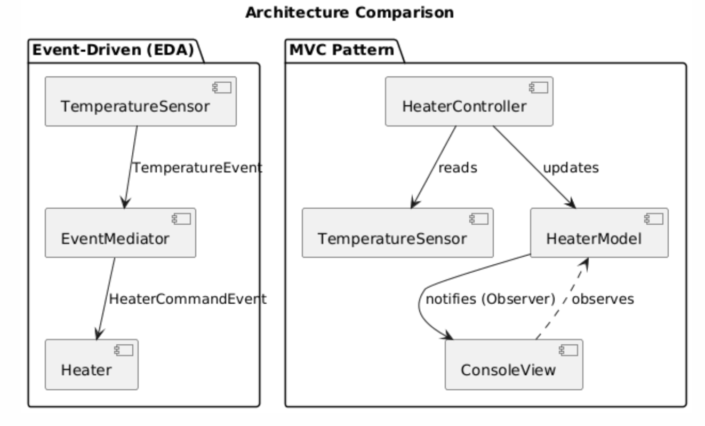

# MVC vs. Event-Driven Architecture


### MVC Pattern ([mvc_heater.py](mvc_heater.py))
- **Model:** `HeaterModel` - Hält nur Daten (`current_temp`, `is_heater_on`)
- **View:** `ConsoleView` - Zeigt Daten formatiert an
- **Controller:** `HeaterController` - Orchestriert alles und enthält Geschäftslogik

### Event-Driven Architecture ([eda_heater.py](eda_heater.py))
- **Event Producer:** `TemperatureSensor` - Erzeugt `TemperatureEvent`
- **Mediator:** `EventMediator` - Empfängt Events, enthält Geschäftslogik
- **Event Consumer:** `Heater` - Reagiert auf `HeaterCommandEvent`


---

## 1. Coupling (Kopplung)

### MVC:
**Stärkere Kopplung**

```python
# HeaterController kennt ALLE Komponenten:
def __init__(self, model, view, sensor):
    self.model = model      # kennt Model
    self.view = view        # kennt View
    self.sensor = sensor    # kennt Sensor
```

Der Controller ist das Zentrum und muss alle Komponenten kennen und orchestrieren. Änderungen an einer Komponente können den Controller betreffen.

### EDA:
**Schwächere Kopplung**

```python
# TemperatureSensor kennt NIEMANDEN spezifisch:
def measure_and_publish(self):
    temperature = round(random.uniform(17.0, 23.0), 1)
    event = TemperatureEvent(temperature)
    for listener in self.listeners:  # generische Listener
        listener.on_temperature_event(event)
```

Der Sensor weiß nicht, wer seine Events empfängt. Der Heater weiß nicht, wer Commands sendet. Nur der Mediator kennt beide Seiten.

**Gewinner:** Event-Driven Architecture (geringere Kopplung)

---

## 2. Erweiterbarkeit

### Szenario: Eine Klimaanlage hinzufügen

#### MVC:
```python
# Controller MUSS geändert werden:
def run(self, iterations=5):
    temp = self.sensor.read_temperature()
    self.model.update_temperature(temp)

    # NEUE LOGIK hinzufügen:
    if temp < 20.0:
        self.model.set_heater_state(True)
        self.model.set_ac_state(False)  # neu
    elif temp > 26.0:
        self.model.set_heater_state(False)
        self.model.set_ac_state(True)  # neu
    else:
        self.model.set_heater_state(False)
        self.model.set_ac_state(False)  # neu
```

**Änderungen erforderlich:**
- ✗ Controller muss modifiziert werden
- ✗ Model muss erweitert werden
- ✗ View muss angepasst werden

#### EDA:
```python
# Einfach neuen Consumer hinzufügen:
class AirConditioner:
    def __init__(self):
        self.is_on = False

    def on_ac_command(self, command):
        self.is_on = command.turn_on

# Mediator erweitern (Open/Closed Principle):
def on_temperature_event(self, event):
    if event.temperature < 20.0:
        self.heater.on_heater_command(HeaterCommandEvent(True))
    elif event.temperature > 26.0:
        self.ac.on_ac_command(ACCommandEvent(True))  # neu
```

**Änderungen erforderlich:**
- ✓ Sensor bleibt unverändert
- ✓ Nur Mediator erweitern (zentrale Logik)
- ✓ Neue Consumer-Klasse hinzufügen

**Gewinner:** Event-Driven Architecture (bessere Erweiterbarkeit)

---

## 3. Komplexität

### MVC:
**Einfacher für kleine Systeme**

- Linearer Ablauf, leicht nachvollziehbar
- Weniger Indirektionen
- Klare Verantwortlichkeiten

**Vorteile:**
- Direkter, imperativ
- Keine Event-Mechanismen nötig
- Einfacher zu debuggen (direkte Aufrufe)

**Nachteile:**
- Controller wird bei Wachstum komplex
- Alles fest verdrahtet

### EDA:
**Mehr Overhead, skaliert besser**

- Event-Infrastruktur notwendig
- Indirekte Kommunikation über Events
- Mehr Klassen/Strukturen

**Vorteile:**
- Komponenten unabhängig testbar
- Neue Komponenten ohne Änderung bestehender hinzufügen
- Skaliert bei vielen Komponenten

**Nachteile:**
- Indirektionen erschweren Debugging
- Event-Flow nicht direkt sichtbar
- Overkill für triviale Systeme
